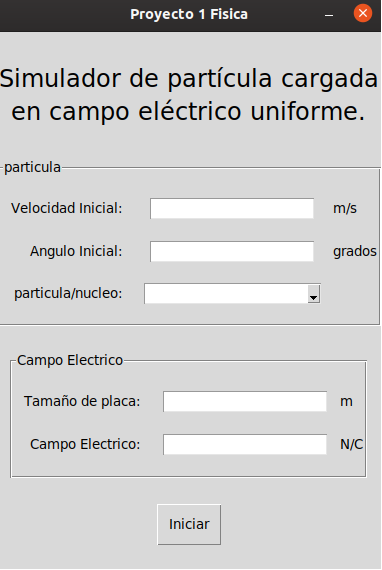

## Simulación de una partícula carga en un campo eléctrico uniforme.

### Integrantes:

1. Fernando Hengstenberg
2. Carlos Chew

### Descripción
El objetivo de este proyecto es simular el comportamiento de diversas partículas cargadas y con masa en presencia de un campo eléctrico uniforme. Para este trabajo solamente se trabajarán con diez partículas; protón, electrón, neutrón, alfa, positrón, deuterio, muón tau y triduo. 

La simulación fue desarrollada en el lenguaje de programación python, el cual cumplía todos los requisitos para poder cumplir nuestro objetivo.


### Instalación:
```
git clone https://github.com/11hengstenberg/electric_field_simulator.git
pip install -r requirements.txt
```
### Ejecución:
`python ui.py`

### Interfaz
En la interfaz debe ingresar los datos, seleccionar la partícula y seleccionar iniciar.



